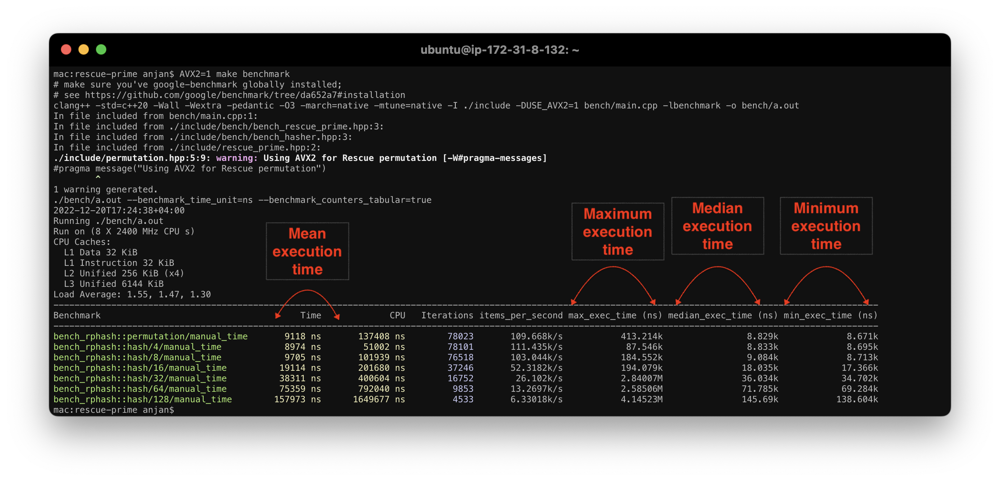

# rescue-prime
Rescue Prime Hash Function

## Overview

Arithmetization friendly hash functions i.e. a hash function which works with prime field elements instead of working with raw bits/ bytes/ N -bit words as used by general-purpose hash functions such as SHA3-256, SHA256 or BLAKE3 etc., are very much used in STARK proof systems, due to the fact that their arithmetic circuit over prime field Z_q is much easier to prove. Rescue-Prime hash function is one such arithmetization friendly hash function, which is used by Winterfell STARK prover.

In Winterfell STARK prover, Rescue permutation is performed over prime field Z_q | q = $2^{64} - 2^{32} + 1$ i.e. the hash function exposes API of following form

- Input: N (>0) -many elements ∈ Z_q | q = $2^{64} - 2^{32} + 1$
- Output: 4 elements ∈ Z_q | q = $2^{64} - 2^{32} + 1$

Here I'm maintaining yet another implementation of Rescue Prime hash function over Z_q | q = $2^{64} - 2^{32} + 1$ which is conformant with Winterfell implementation. 

`rescue-prime` is a zero-dependency, header-only, C++ library which is easy to use. I've written both scalar & vectorized Rescue implementations. If target CPU has AVX2, it can be used to perform Rescue permutation faster.

> **Note**

> For understanding STARK https://aszepieniec.github.io/stark-anatomy

> **Note**

> Original Rescue specification https://ia.cr/2020/1143

> **Note**

> Read more about Rescue Prime in Winterfell [here](https://github.com/novifinancial/winterfell/tree/21173bdf3e552ca7662c7aa2d34515b084ae21b0/crypto)

> **Note**

> Find more about Winterfell https://github.com/novifinancial/winterfell

## Prerequisites

- A C++ compiler, with C++20 standard library such as `g++`/ `clang++`

```bash
$ clang++ --version
Ubuntu clang version 14.0.0-1ubuntu1
Target: aarch64-unknown-linux-gnu
Thread model: posix
InstalledDir: /usr/bin

$ g++ --version
g++ (Ubuntu 11.2.0-19ubuntu1) 11.2.0
```

- System development utilities such as `make`, `cmake` & `git`

```bash
$ make --version
GNU Make 4.3

$ cmake --version
cmake version 3.22.1

$ git --version
git version 2.34.1
```

- For benchmarking Rescue Prime implementation on CPU systems, you'll need to have `google-benchmark` globally installed. I found [this](https://github.com/google/benchmark/tree/da652a7#installation) guide useful.

## Testing

For ensuring functional correctness and compatibility with Winterfell implementation of Rescue Prime Hashing over Z_q | q = $2^{64} - 2^{32} + 1$, issue

> **Note** Find Winterfell implementation of Rescue Prime [here](https://github.com/novifinancial/winterfell/tree/21173bdf3e552ca7662c7aa2d34515b084ae21b0/crypto#rescue-hash-function-implementation)

> **Note** Rescue Permutation test vectors are adapted from [here](https://github.com/novifinancial/winterfell/blob/21173bdf3e552ca7662c7aa2d34515b084ae21b0/crypto/src/hash/rescue/rp64_256/tests.rs)

```bash
make # tests scalar implementation

[test] Rescue Prime field arithmetic
[test] Rescue Permutation
```

If your target CPU has AVX2 features, try testing that implementation by issuing

```bash
AVX2=1 make # tests AVX2 implementation

[test] Rescue Prime field arithmetic
[test] Vectorized Rescue Prime field arithmetic
[test] Rescue Permutation
```

## Benchmarking

For benchmarking 

- Rescue Permutation over Z_q | q = $2^{64} -2^{32} + 1$
- Z_q element hasher | # -of input elements ∈ {4, 8, 16, 32, 64, 128}

issue following

```bash
make benchmark # benchmarks scalar implementation
```

If your target CPU has AVX2 features, you may want to benchmark that implementation by issuing

```bash
AVX2=1 make benchmark # benchmarks AVX2 implementation
```

> **Note**

> Benchmarking expects presence of google-benchmark library in global namespace ( so that it can be found by the compiler ).

> **Warning**

> Because most of the CPUs employ dynamic frequency boosting technique, when benchmarking routines, you may want to disable CPU frequency scaling by following [this](https://github.com/google/benchmark/blob/da652a7/docs/user_guide.md#disabling-cpu-frequency-scaling) guide.

> **Note** If you have trouble interpreting following benchmark results, see this annotated screen capture.



### On Intel(R) Xeon(R) Platinum 8375C CPU @ 2.90GHz ( **Scalar** implementation compiled with GCC )

```bash
2022-12-22T15:39:15+00:00
Running ./bench/a.out
Run on (128 X 2072.24 MHz CPU s)
CPU Caches:
  L1 Data 48 KiB (x64)
  L1 Instruction 32 KiB (x64)
  L2 Unified 1280 KiB (x64)
  L3 Unified 55296 KiB (x2)
Load Average: 0.11, 0.04, 0.01
-------------------------------------------------------------------------------------------------------------------------------------------------------------
Benchmark                                      Time             CPU   Iterations items_per_second max_exec_time (ns) median_exec_time (ns) min_exec_time (ns)
-------------------------------------------------------------------------------------------------------------------------------------------------------------
bench_rphash::permutation/manual_time      31499 ns        43123 ns        22224       31.7467k/s            33.988k               31.489k            31.363k
bench_rphash::hash/4/manual_time           32136 ns        36090 ns        21782        31.118k/s            38.102k               32.124k            31.998k
bench_rphash::hash/8/manual_time           31821 ns        39618 ns        22000        31.426k/s             42.13k               31.806k            31.681k
bench_rphash::hash/16/manual_time          63608 ns        79070 ns        11005       15.7213k/s            68.194k               63.588k            63.417k
bench_rphash::hash/32/manual_time         127188 ns       157987 ns         5504        7.8624k/s           129.934k               127.15k           126.867k
bench_rphash::hash/64/manual_time         254360 ns       315933 ns         2752       3.93144k/s           288.681k              254.272k           253.928k
bench_rphash::hash/128/manual_time        508638 ns       632906 ns         1376       1.96603k/s            522.51k              508.456k            507.97k
```

### On Intel(R) Xeon(R) Platinum 8375C CPU @ 2.90GHz ( **AVX2** implementation compiled with GCC )

```bash
2022-12-22T15:40:04+00:00
Running ./bench/a.out
Run on (128 X 1292.25 MHz CPU s)
CPU Caches:
  L1 Data 48 KiB (x64)
  L1 Instruction 32 KiB (x64)
  L2 Unified 1280 KiB (x64)
  L3 Unified 55296 KiB (x2)
Load Average: 0.13, 0.06, 0.01
-------------------------------------------------------------------------------------------------------------------------------------------------------------
Benchmark                                      Time             CPU   Iterations items_per_second max_exec_time (ns) median_exec_time (ns) min_exec_time (ns)
-------------------------------------------------------------------------------------------------------------------------------------------------------------
bench_rphash::permutation/manual_time      13742 ns        25366 ns        50938       72.7718k/s            16.197k               13.738k            13.646k
bench_rphash::hash/4/manual_time           13756 ns        17694 ns        50886       72.6964k/s            21.138k               13.752k            13.677k
bench_rphash::hash/8/manual_time           13751 ns        21534 ns        50901       72.7217k/s            16.273k               13.747k            13.669k
bench_rphash::hash/16/manual_time          27480 ns        42949 ns        25473       36.3899k/s            32.871k               27.473k            27.356k
bench_rphash::hash/32/manual_time          54944 ns        85784 ns        12740       18.2003k/s            59.909k               54.927k            54.784k
bench_rphash::hash/64/manual_time         109873 ns       171524 ns         6371       9.10138k/s            185.71k              109.828k           109.609k
bench_rphash::hash/128/manual_time        219703 ns       344066 ns         3186       4.55159k/s           232.839k              219.643k           219.373k
```

### On Intel(R) Xeon(R) Platinum 8375C CPU @ 2.90GHz ( **Scalar** implementation compiled with Clang )

```bash
2022-12-22T15:40:48+00:00
Running ./bench/a.out
Run on (128 X 1295.09 MHz CPU s)
CPU Caches:
  L1 Data 48 KiB (x64)
  L1 Instruction 32 KiB (x64)
  L2 Unified 1280 KiB (x64)
  L3 Unified 55296 KiB (x2)
Load Average: 0.14, 0.08, 0.02
-------------------------------------------------------------------------------------------------------------------------------------------------------------
Benchmark                                      Time             CPU   Iterations items_per_second max_exec_time (ns) median_exec_time (ns) min_exec_time (ns)
-------------------------------------------------------------------------------------------------------------------------------------------------------------
bench_rphash::permutation/manual_time       9735 ns        22576 ns        71907       102.723k/s            12.152k                9.732k             9.673k
bench_rphash::hash/4/manual_time            9746 ns        14100 ns        71820       102.606k/s            18.543k                9.742k             9.681k
bench_rphash::hash/8/manual_time            9749 ns        18356 ns        71795       102.578k/s            11.831k                9.746k             9.681k
bench_rphash::hash/16/manual_time          19480 ns        36583 ns        35937       51.3342k/s            23.983k               19.474k            19.382k
bench_rphash::hash/32/manual_time          38931 ns        73003 ns        17979       25.6863k/s            42.868k               38.921k            38.769k
bench_rphash::hash/64/manual_time          77837 ns       145841 ns         8994       12.8474k/s            81.722k               77.814k            77.656k
bench_rphash::hash/128/manual_time        155657 ns       291537 ns         4497        6.4244k/s           158.186k              155.614k           155.404k
```

### On Intel(R) Xeon(R) Platinum 8375C CPU @ 2.90GHz ( **AVX2** implementation compiled with Clang )

```bash
2022-12-22T15:41:42+00:00
Running ./bench/a.out
Run on (128 X 2035.27 MHz CPU s)
CPU Caches:
  L1 Data 48 KiB (x64)
  L1 Instruction 32 KiB (x64)
  L2 Unified 1280 KiB (x64)
  L3 Unified 55296 KiB (x2)
Load Average: 0.21, 0.11, 0.03
-------------------------------------------------------------------------------------------------------------------------------------------------------------
Benchmark                                      Time             CPU   Iterations items_per_second max_exec_time (ns) median_exec_time (ns) min_exec_time (ns)
-------------------------------------------------------------------------------------------------------------------------------------------------------------
bench_rphash::permutation/manual_time       9603 ns        22470 ns        72890        104.13k/s            17.661k                9.599k             9.527k
bench_rphash::hash/4/manual_time            9612 ns        13965 ns        72826       104.039k/s            18.814k                9.609k             9.535k
bench_rphash::hash/8/manual_time            9613 ns        18212 ns        72818       104.024k/s            16.387k                 9.61k             9.532k
bench_rphash::hash/16/manual_time          19203 ns        36295 ns        36448       52.0739k/s            23.494k               19.198k            19.104k
bench_rphash::hash/32/manual_time          38372 ns        72446 ns        18242       26.0607k/s            41.034k               38.361k             38.22k
bench_rphash::hash/64/manual_time          76717 ns       144751 ns         9124       13.0349k/s            80.947k               76.692k            76.503k
bench_rphash::hash/128/manual_time        153405 ns       289330 ns         4563       6.51869k/s           178.467k              153.358k           153.099k
```

### On Intel(R) Core(TM) i5-8279U CPU @ 2.40GHz ( **Scalar** implementation compiled with Clang )

```bash
2022-12-22T19:43:28+04:00
Running ./bench/a.out
Run on (8 X 2400 MHz CPU s)
CPU Caches:
  L1 Data 32 KiB
  L1 Instruction 32 KiB
  L2 Unified 256 KiB (x4)
  L3 Unified 6144 KiB
Load Average: 1.19, 2.15, 2.89
-------------------------------------------------------------------------------------------------------------------------------------------------------------
Benchmark                                      Time             CPU   Iterations items_per_second max_exec_time (ns) median_exec_time (ns) min_exec_time (ns)
-------------------------------------------------------------------------------------------------------------------------------------------------------------
bench_rphash::permutation/manual_time      11417 ns       137884 ns        61405       87.5911k/s           119.946k               11.218k            11.065k
bench_rphash::hash/4/manual_time           11567 ns        54524 ns        61425       86.4507k/s            120.79k               11.236k            11.071k
bench_rphash::hash/8/manual_time           11464 ns        95950 ns        61527        87.228k/s           145.688k               11.236k            11.081k
bench_rphash::hash/16/manual_time          22696 ns       189947 ns        30847       44.0598k/s           138.261k               22.402k             22.13k
bench_rphash::hash/32/manual_time          45439 ns       381059 ns        15416       22.0077k/s           191.966k               44.724k            44.247k
bench_rphash::hash/64/manual_time          91015 ns       763956 ns         7709       10.9872k/s           1.46905M               89.331k            88.494k
bench_rphash::hash/128/manual_time        188629 ns      1596825 ns         3871       5.30141k/s            435.33k               178.67k           176.944k
```

### On Intel(R) Core(TM) i5-8279U CPU @ 2.40GHz ( **AVX2** implementation compiled with Clang )

```bash
2022-12-22T19:45:04+04:00
Running ./bench/a.out
Run on (8 X 2400 MHz CPU s)
CPU Caches:
  L1 Data 32 KiB
  L1 Instruction 32 KiB
  L2 Unified 256 KiB (x4)
  L3 Unified 6144 KiB
Load Average: 1.97, 2.11, 2.79
-------------------------------------------------------------------------------------------------------------------------------------------------------------
Benchmark                                      Time             CPU   Iterations items_per_second max_exec_time (ns) median_exec_time (ns) min_exec_time (ns)
-------------------------------------------------------------------------------------------------------------------------------------------------------------
bench_rphash::permutation/manual_time       8858 ns       134181 ns        79128       112.898k/s           126.803k                8.722k             8.545k
bench_rphash::hash/4/manual_time            8874 ns        50963 ns        79380       112.692k/s           123.209k                8.724k              8.55k
bench_rphash::hash/8/manual_time            8880 ns        92534 ns        79036       112.609k/s            97.469k                8.728k             8.549k
bench_rphash::hash/16/manual_time          17671 ns       185488 ns        39656         56.59k/s            98.486k               17.376k            17.082k
bench_rphash::hash/32/manual_time          35122 ns       368258 ns        19880       28.4719k/s           183.345k               34.633k            34.112k
bench_rphash::hash/64/manual_time          70485 ns       737101 ns        10012       14.1873k/s           4.48529M               69.141k            68.175k
bench_rphash::hash/128/manual_time        140581 ns      1482180 ns         4985       7.11335k/s           330.147k              138.158k           136.303k
```

### On ARM Neoverse-V1 aka AWS Graviton3 ( **Scalar** implementation compiled with GCC )

```bash
2022-12-22T15:48:54+00:00
Running ./bench/a.out
Run on (64 X 2100 MHz CPU s)
CPU Caches:
  L1 Data 64 KiB (x64)
  L1 Instruction 64 KiB (x64)
  L2 Unified 1024 KiB (x64)
  L3 Unified 32768 KiB (x1)
Load Average: 0.08, 0.02, 0.01
-------------------------------------------------------------------------------------------------------------------------------------------------------------
Benchmark                                      Time             CPU   Iterations items_per_second max_exec_time (ns) median_exec_time (ns) min_exec_time (ns)
-------------------------------------------------------------------------------------------------------------------------------------------------------------
bench_rphash::permutation/manual_time      17051 ns        31612 ns        41058       58.6473k/s            23.325k               17.024k            16.957k
bench_rphash::hash/4/manual_time           17107 ns        22032 ns        40920       58.4551k/s            27.503k                17.08k            17.013k
bench_rphash::hash/8/manual_time           17060 ns        26937 ns        41039        58.617k/s            38.753k               17.032k            16.963k
bench_rphash::hash/16/manual_time          34090 ns        53631 ns        20533       29.3341k/s            45.077k               34.035k            33.944k
bench_rphash::hash/32/manual_time          68140 ns       107193 ns        10274       14.6757k/s            82.014k               68.029k            67.896k
bench_rphash::hash/64/manual_time         136230 ns       214227 ns         5138       7.34055k/s           146.935k              136.014k            135.83k
bench_rphash::hash/128/manual_time        272428 ns       428993 ns         2570        3.6707k/s           283.816k              271.989k           271.714k
```

### On ARM Neoverse-V1 aka AWS Graviton3 ( **NEON** implementation compiled with GCC )

```bash
2022-12-22T15:50:11+00:00
Running ./bench/a.out
Run on (64 X 2100 MHz CPU s)
CPU Caches:
  L1 Data 64 KiB (x64)
  L1 Instruction 64 KiB (x64)
  L2 Unified 1024 KiB (x64)
  L3 Unified 32768 KiB (x1)
Load Average: 0.15, 0.05, 0.02
-------------------------------------------------------------------------------------------------------------------------------------------------------------
Benchmark                                      Time             CPU   Iterations items_per_second max_exec_time (ns) median_exec_time (ns) min_exec_time (ns)
-------------------------------------------------------------------------------------------------------------------------------------------------------------
bench_rphash::permutation/manual_time      17119 ns        31696 ns        40891       58.4156k/s            50.317k               17.092k            17.019k
bench_rphash::hash/4/manual_time           17236 ns        22195 ns        40606       58.0188k/s            26.107k                17.21k            17.151k
bench_rphash::hash/8/manual_time           17152 ns        27013 ns        40812       58.3027k/s            40.492k               17.126k            17.056k
bench_rphash::hash/16/manual_time          34278 ns        53945 ns        20420       29.1735k/s            57.256k               34.225k            34.102k
bench_rphash::hash/32/manual_time          68511 ns       107882 ns        10215       14.5962k/s            92.947k               68.413k            68.261k
bench_rphash::hash/64/manual_time         136978 ns       215582 ns         5110       7.30046k/s           143.904k              136.786k           136.576k
bench_rphash::hash/128/manual_time        273909 ns       431178 ns         2555       3.65085k/s           286.895k              273.525k           273.209k
```

### On ARM Neoverse-V1 aka AWS Graviton3 ( **Scalar** implementation compiled with Clang )

```bash
2022-12-22T15:51:07+00:00
Running ./bench/a.out
Run on (64 X 2100 MHz CPU s)
CPU Caches:
  L1 Data 64 KiB (x64)
  L1 Instruction 64 KiB (x64)
  L2 Unified 1024 KiB (x64)
  L3 Unified 32768 KiB (x1)
Load Average: 0.13, 0.07, 0.02
-------------------------------------------------------------------------------------------------------------------------------------------------------------
Benchmark                                      Time             CPU   Iterations items_per_second max_exec_time (ns) median_exec_time (ns) min_exec_time (ns)
-------------------------------------------------------------------------------------------------------------------------------------------------------------
bench_rphash::permutation/manual_time      17550 ns        32973 ns        39886       56.9786k/s            30.101k               17.521k            17.427k
bench_rphash::hash/4/manual_time           17560 ns        22696 ns        39864        56.948k/s            40.568k                17.53k             17.43k
bench_rphash::hash/8/manual_time           17555 ns        27777 ns        39855       56.9635k/s             26.61k               17.527k            17.433k
bench_rphash::hash/16/manual_time          35088 ns        55486 ns        19950       28.4996k/s            54.669k               35.032k            34.889k
bench_rphash::hash/32/manual_time          70136 ns       110887 ns         9978        14.258k/s            78.483k               70.023k            69.828k
bench_rphash::hash/64/manual_time         140230 ns       221700 ns         4992       7.13113k/s           149.666k              140.014k           139.697k
bench_rphash::hash/128/manual_time        280417 ns       443432 ns         2496       3.56611k/s           286.263k              280.025k           279.561k
```

### On ARM Neoverse-V1 aka AWS Graviton3 ( **NEON** implementation compiled with Clang )

```bash
2022-12-22T15:51:50+00:00
Running ./bench/a.out
Run on (64 X 2100 MHz CPU s)
CPU Caches:
  L1 Data 64 KiB (x64)
  L1 Instruction 64 KiB (x64)
  L2 Unified 1024 KiB (x64)
  L3 Unified 32768 KiB (x1)
Load Average: 0.15, 0.09, 0.03
-------------------------------------------------------------------------------------------------------------------------------------------------------------
Benchmark                                      Time             CPU   Iterations items_per_second max_exec_time (ns) median_exec_time (ns) min_exec_time (ns)
-------------------------------------------------------------------------------------------------------------------------------------------------------------
bench_rphash::permutation/manual_time      18277 ns        33684 ns        38300       54.7146k/s            30.028k                18.25k            18.154k
bench_rphash::hash/4/manual_time           18287 ns        23426 ns        38278       54.6826k/s            25.803k                18.26k            18.169k
bench_rphash::hash/8/manual_time           18290 ns        28515 ns        38273       54.6752k/s            42.531k               18.262k            18.158k
bench_rphash::hash/16/manual_time          36553 ns        56968 ns        19150       27.3573k/s            45.235k                 36.5k            36.317k
bench_rphash::hash/32/manual_time          73058 ns       113815 ns         9581       13.6877k/s             95.43k               72.949k            72.773k
bench_rphash::hash/64/manual_time         146111 ns       227554 ns         4791       6.84411k/s           156.203k              145.895k           145.631k
bench_rphash::hash/128/manual_time        292153 ns       455092 ns         2396       3.42286k/s           302.318k              291.729k           291.347k
```
